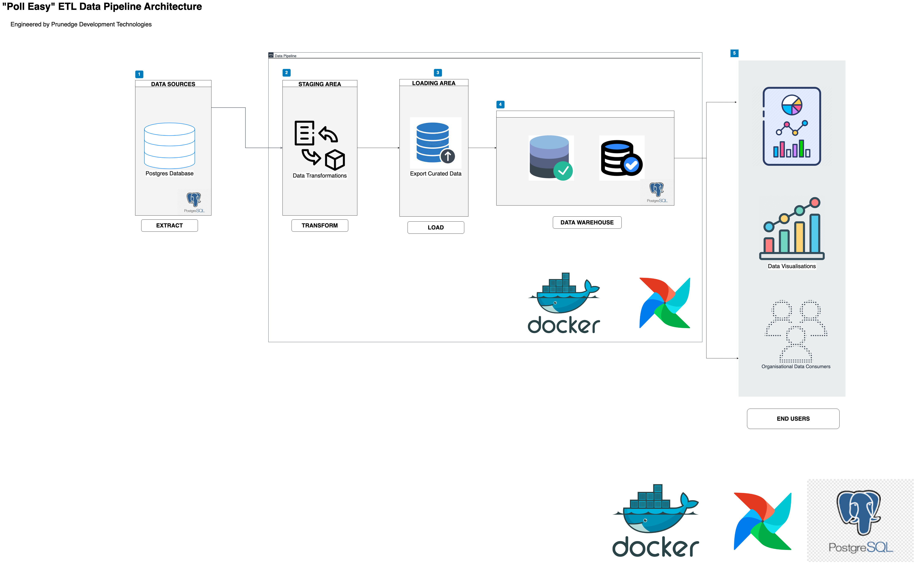

# Building a ETL Data Pipeline with Spark, Airflow & Docker.

## Overview

Developing an ETL pipeline for the “Poll-Easy” project 

## Setting Up the ETL

An ETL pipeline is the set of processes used to move data from a source or multiple sources into a database such as a data warehouse. 
To enable a smooth, automated flow of data from one stage to another, a data pipeline is to be orchestrated using (Airflow, Python):

- The ETL we will be building would be puling data from a Postgres database. 
- That data would then go through series of transformations and data cleaning processes to be production-ready 
- The data is to be processed in a format that is easily usable by Data Scientists and Analysts within the team. 
- The SQL syntax for this process would be PostgreSQL. 
- The source and destination databases are the same.
- We are to create a new table in the original Postgres database. 
- Postgres would serve as the Data Warehouse for the project. 

## System Architecture

